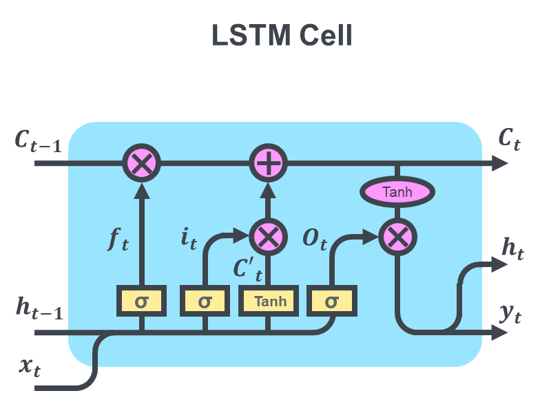

# Introduction

## Fusion plasmas… why are they important?

The development of fusion plasma devices has rapidly increased in the last 20 years, bringing us ever closer to green, sustainable energy. Plasmas as the fourth state of matter where ions and electrons are unbound and move freely from one another at high temperatures. These high temperatures and pressures maintained by various heating techniques and supercooled magnets cause nuclei to fuse, generating massive amounts of energy. However, maintaining a fusion plasma is no easy task. 
Safe ignition, maintenance and dispersion of plasma discharges is heavily reliant on the capabilities of the diagnostic sensors. Plasma parameters such as electron temperature, density and potential are calculated from data collected by these diagnostic sensors. These parameters can then be used to determine the form of the plasma, weather the plasma is stable or tending to instability e.t.c..  

Conventional diagnostic techniques for extracting the plasma parameters, such as the Langmuir probe, involve active and indirect measure of the plasma. In this case, the plasma is changed in a small area by the diagnostic to probe the characteristics from it. However, these types of measurement usually require a certain amount of offline-computation, hence cannot be used as in-line diagnostic tools. Additionally, external factors can greatly affect the accuracy of the plasma measurements.
In this paper, found [Here](https://www.mdpi.com/1424-8220/22/11/4281 "A Long Short-Term Memory Network for Plasma Diagnosis from Langmuir Probe Data"),  aims to create a more universal method of plasma diagnosis by speeding up accurate parameter calculation using long short-term memory (LSTM) neural networks (NN) be eliminating the influence of external factors. 

## The Langmuir probe and how it works
The Langmuir probe technique, proposed in 1926, is used to measure electron density $n_e$, electronic temperature $T_e$, and plasma potential $\phi_p$. A Langmuir probe consists of a metal wire/disk/ball that is inserted into the plasma and electrically polarized with respect to a reference voltage in order to collect currents of ions or electrons [[1]](https://aapt.scitation.org/doi/10.1119/1.2772282 "Understanding Langmuir probe current-voltage characteristics"). An example of one can been seen:

Langmuir's method consists of obtaining these plasma parameters from characteristic curves of current vs. voltage (I-V) of the probe. This I-V characteristic is obtained by sweeping a bias voltage (VB) from negative to positive potentials. Fromm these curves the plasma characteristics are calculated from specific features of the curve:

[")](https://aapt.scitation.org/doi/10.1119/1.2772282)

The total current in the probe is represented by the black curve and the ionic and electron current are represented by the blue and red curves respectively. 
The point where the VB of the probe changes sign is known as the floating potential $V_f$. The plasma potential $V_p$ is related to the point where all electrons are repelled i.e., at electron saturation current $I_{se}$ a
The maximum of the first derivative of the curve determines the electron temperature (EQN)
And the electron density is related to the ion saturation current \\
$$ I_{e0}=\frac{2}{\pi}n_eA_e\sqrt{\frac{K_BT_e}{2\pi m_e}} $$
These Characteristics are obtained post-processing and curve fitting of the data collected during experimentation. However, the I-V characteristic drastically deviates from the standard from if the surface layer of the probe is contaminated or if the probe is placed in a low-density plasma. 

## Problems with measurements

## Aims of the Network

## Machine Learning 
Predicting $n_e$ and $T_e$ is a simple regression problem and can be resolved with a simple multi-layer perceptron (MLP) network. These MLP networks are relatively easy to use and lightweight, but not suited to characterise messy data that could be affected by multiple factors of varying degrees (such as the level of contamination).  Hence, instead of using one-way propagation system in the MLP, they use a neural network structure called long short-term memory network (LSTM). 

## LSTM 

